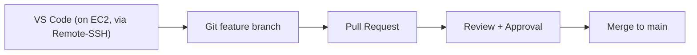
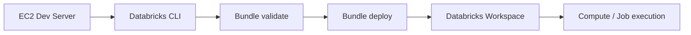
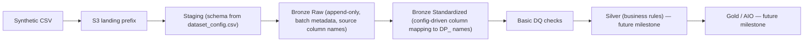

# MedalForge — Architecture & Mission

## Mission

Replicate the production Medallion-architecture data pipeline pattern used at
DataPoem (Bronze → Silver → Gold, config-driven, no hardcoding) in a personal,
synthetic-data-only lab — to prove the underlying engineering can be *built*,
not just operated. No real client (Walmart / Unilever / Nielsen) data, column
names, or logic will ever be committed to this repository.

This project exists to:
1. Practice the exact production pattern end to end, on a small scale.
2. Learn the AWS + Databricks + Unity Catalog setup normally done for you.
3. Build a portfolio artifact that can be explained end to end in interviews.
4. Support a Senior Data Engineer job search with real, demonstrable evidence.

---

## The Three Architectures

Every data platform project is really three separate, independently-triggered
flows. Confusing them (e.g. assuming a Git merge deploys code, or a deploy
moves data) is a common mistake this project is deliberately structured to
avoid.

### 1. Software Engineering Flow

*Where the code lives, and how it gets reviewed.*



- Code is written on the EC2 dev server, never locally, matching a real
  company setup.
- `main` is branch-protected: no direct pushes, PR + approval required.
- **A merge to `main` does not deploy anything.** It only updates code
  history. Deployment is a separate, explicit action (see Flow 2).

### 2. Data Platform / Cloud Flow

*Where the code actually runs.*



- One EC2 instance is the single "coding office" — it targets every
  environment (`dev`, later `staging`/`prod`) by changing only the
  `-t` flag on the Databricks CLI, never the machine itself.
- `databricks bundle validate → deploy → run` is the only path from code to
  a running job. There is no other way for code to reach Databricks.
- Environments differ by **Unity Catalog catalog name and permissions**, not
  by EC2 instance — `lca_paid_media_dev`, later `_staging`, `_prod`.

### 3. Data Flow

*What happens to the data once a job runs.*



- The S3 object is treated as immutable.
- Staging schema, column renaming, and DQ rules are **all config-driven**
  (`dataset_config.csv`, `column_mapping_config.csv`,
  `data_quality_rule_config.csv`) — no hardcoded column names in code, so a
  new source column only requires a config change.
- Bronze Raw never deduplicates or transforms — it is the immutable source
  of truth as received.
- A reused batch number is rejected, so an accidental rerun cannot duplicate
  a batch.

---

## How the Three Flows Connect

```
Git branch merged           →  code history updated only
        +
Databricks bundle deployed  →  code now exists in the workspace
        +
Databricks job run           →  data actually moves through the data flow
```

None of these three steps implies the next. Each is a deliberate, separate
action — by design.

---

## Trust Boundaries

- Git stores code, configuration, tests, and synthetic data only.
- AWS credentials and Databricks profiles never enter the repository.
- Databricks accesses S3 through a Unity Catalog storage credential and
  external location — never embedded keys.
- The EC2 security group allows SSH via key-pair only; password login is
  disabled.
